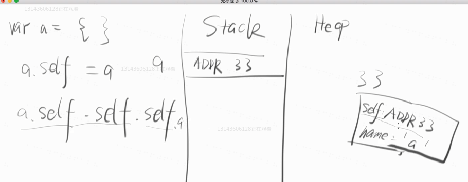
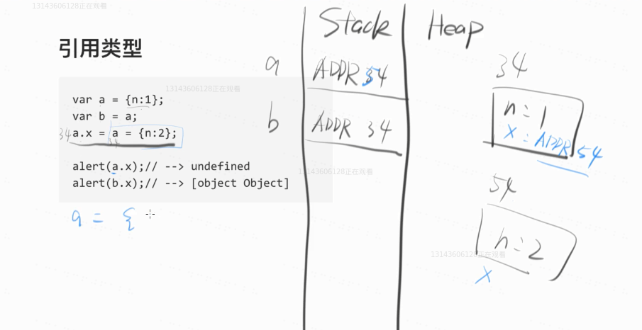
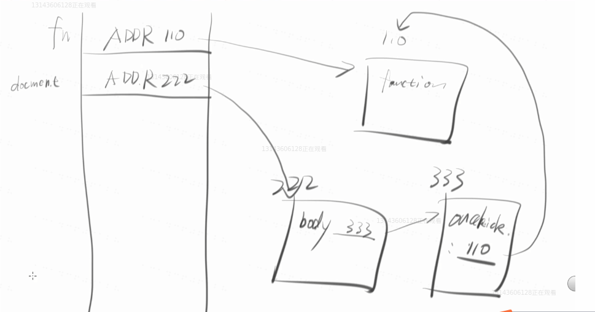

# JS基础之内存图

## 类型转换

### 1.转换成String

object.toString()   打印出  [object Object]

console.log()   会隐式调用toString()

对象的属性访问也会隐式地调用toString()


老司机用 `+ ''`的方式    这个甚至可以转换null和undefined


### 2.boolean

！！ 可以快速变成boolean 比如  `!! 2` //true

NaN是false


### 3.Number

Number()

parseInt('1',10)     parse的意思是解析    这里后面的是进制，这里会有一个坑   parseInt('011') =>11   parseInt('011',2) => 3

parseFloat('1.23')   

比较骚的方法：

1.  `- 0`    减0
2. `+ '1'`   前面加正号  


## 内存

栈（stack）

堆( heap )

学会画内存图（笔画和脑子里面画都行）


数字是64位

字符16位

### 内存题目

题目1   循环引用怎么回事

```js
var a = {};
a.slef = a;     //循环引用    画个内存图很好理解
```



题目2   浏览器先看左边，只不过从右边开始算

```js
var a = {n:1};
var b = a;
a.x = a = {n:2};
```

当浏览器看到第三行，会先确定a，先看左边再看右边，只不过将右边算完再回到左边

因此



```js
console.log(a.x);   //undefined
console.log(b.x);	//[[Object object]]
```


### 垃圾回收

如果一个对象没有被引用，他就是垃圾！

一道容易错的题：

```js
var fn = function(){};
document.body.onclick = fn;
fn = null;
```

请问 右边的function(){} 是不是垃圾

很容易误以为是垃圾，其实不是的。

画图可破：



事实上doucment是浏览器一开始就初始化的，一开始就初始化的：window，document是window的一个属性，因此function还是会被引用，不会被回收


内存泄漏就是该回收的垃圾没有被回收   IE6有这个Bug

解决：

```js
window.onunload = function(){
    document.body.onclick = null;
}
```


深拷贝和浅拷贝

拷贝不影响原来的就是深拷贝   比如：

```js
var a = 1;
var b = a;
b = 2;
a   // 1
```

但是对象的赋值是浅拷贝，因为你改变了，原来的对象也会被改变

如何实现对象的深拷贝：

有点复杂，现在不说......


课后题：

1. typeof [1,2,3]    //  'object'  注意打印的是字符

2. ```js
   a =  [];  
   a instanceof Array    //true
   ```

3. ```js
   var a = {0:'a', 1:'b', length: 2}
   a instanceof Array // 值为false       
   ```

instanceof可以判断具体的复杂对象的类型

